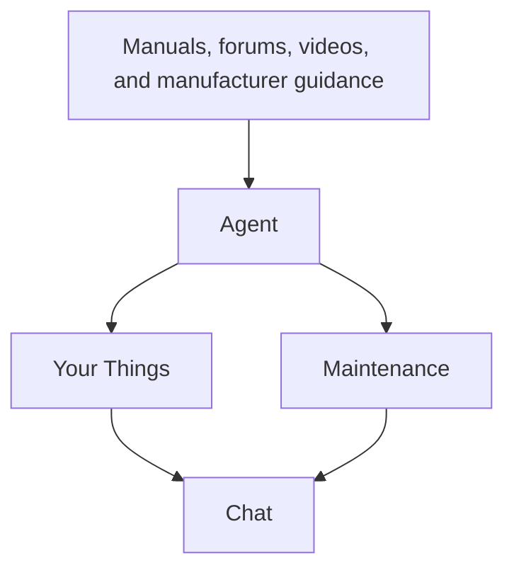
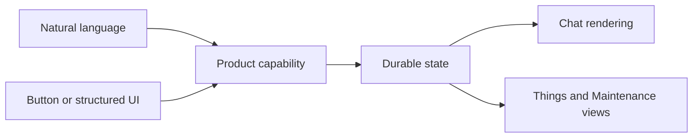
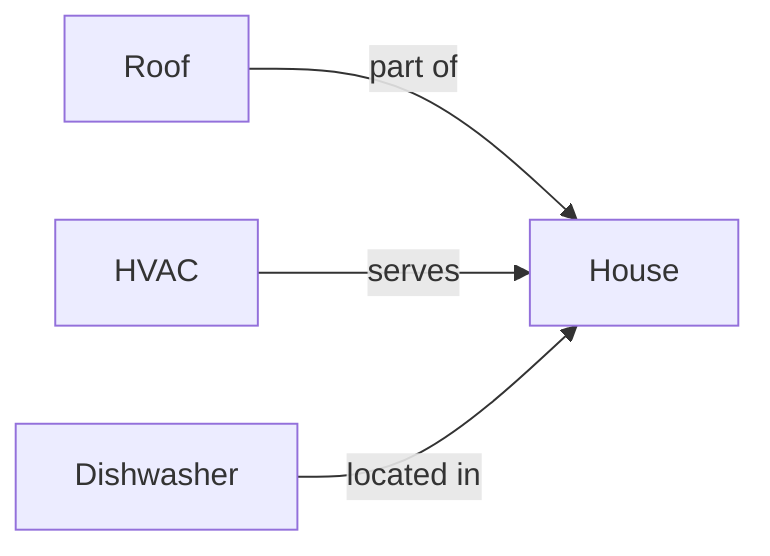
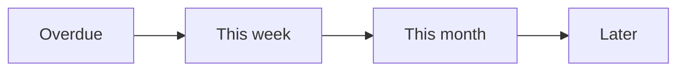
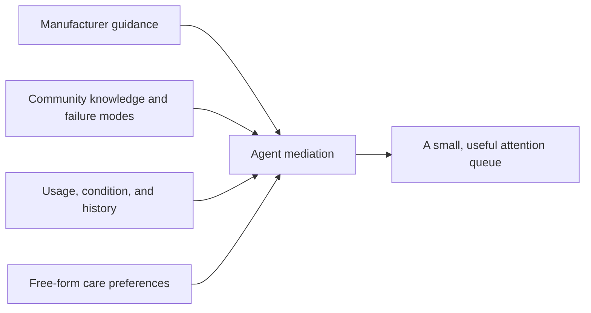
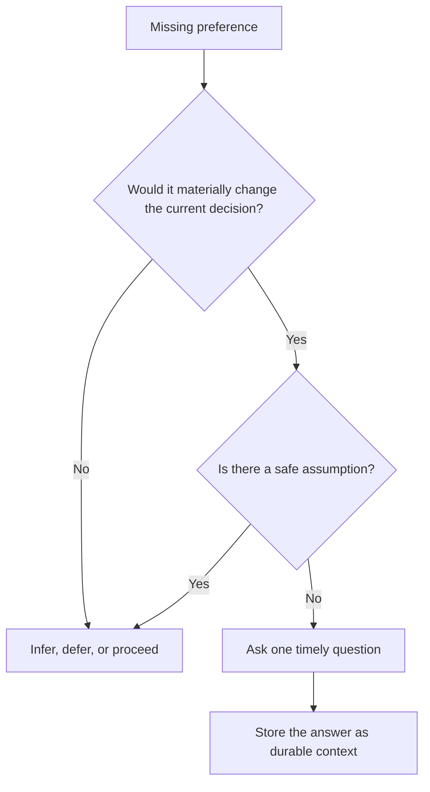
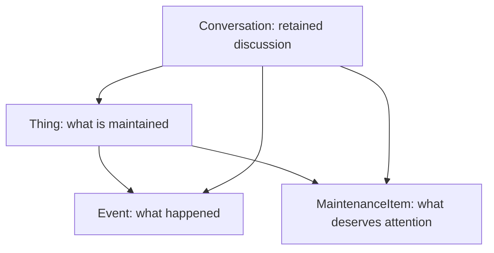
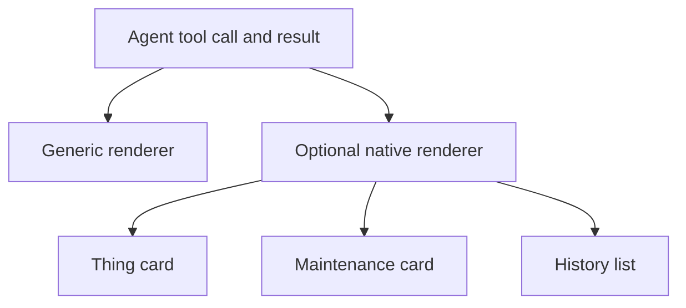
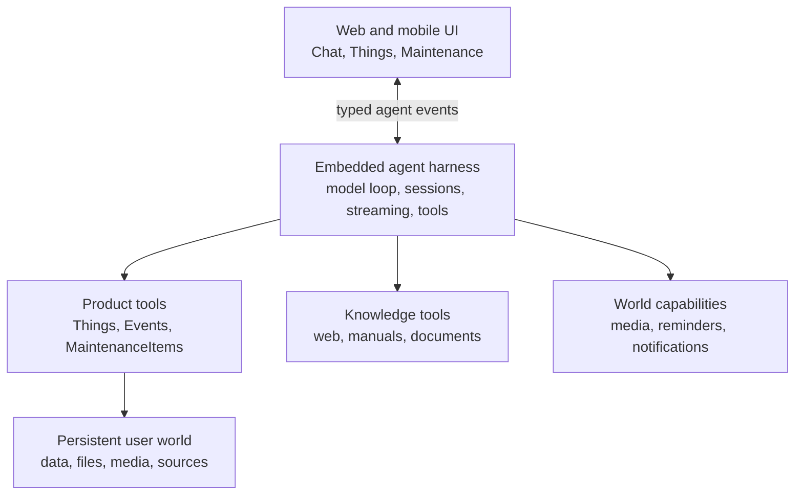

# Maintenance of Everything

The internet knows how to care for almost anything, but owning a house, car, appliance, bike, or machine still means repeatedly searching manuals, videos, forums, and old receipts.

**Maintenance of Everything is a personal agent for taking care of the physical things in your life.**

You talk to it like ChatGPT. Over time it learns what you own, remembers what happened, researches what matters, and helps the right maintenance happen at the right time.



The bet is simple: **do not make the user operate a database about their possessions. Give an agent a durable memory of their physical world and let it help take care of it.**

## The product

There are three primary surfaces:

| Surface | Purpose |
| --- | --- |
| **Chat** | Ask anything and get things done. The primary interface and control plane. |
| **Things** | See the durable, named things the agent understands and maintains with you. |
| **Maintenance** | See what deserves attention now, without managing a rigid calendar. |

Chat is primary. Things and Maintenance are structured projections of the same underlying world.

### Chat

The default experience should feel familiar to anyone who has used ChatGPT: conversations in the main pane, a simple input, and lightweight navigation to Things, Maintenance, and recent conversations.

Natural language should be enough:

> I changed the oil yesterday.

> What's this noise? [video]

> What did I use on the cabinets last time?

> I got the car serviced and they did everything that was due.

When appropriate, the agent translates conversation into durable state.

Structured UI accelerates common interactions. A maintenance card in chat might offer **Done** and **Later**, but tapping **Done** and saying “I did this yesterday” should invoke the same underlying capability.



Anything possible through structured UI should also be possible through natural conversation.

### Things

A **Thing** is a durable, named thing the user cares enough about to maintain independently: a house, roof, HVAC system, 4Runner, dishwasher, road bike, or espresso machine.

Things should be easy to browse as a flat list. Relationships can improve reasoning without forcing the physical world into a folder tree.



Not every concept the agent reasons about needs to become a Thing. A muffler is usually context about a car, not another sidebar item. If the user begins restoring it independently, it can be promoted to a Thing.

**Track what the user would plausibly recognize, revisit, or maintain independently.**

### Maintenance

Maintenance is an attention queue, not a calendar.



Broad windows are often more truthful than exact dates. The system can reason about dates, mileage, usage, seasons, condition, and recurrence without pretending every task is an appointment.

## Agent-mediated maintenance

There is no single correct maintenance schedule for a Thing. Source material describes a universe of possible work; the agent decides what is useful for this person and this Thing.



Care preferences should remain mostly free-form and can differ by Thing:

> Plans to keep the 4Runner long-term. Wants proactive work that materially improves reliability or condition. Normally uses a shop for scheduled service and does not want separate reminders for minor inspections included in that service.

Granularity is mediated too. A shop customer may need one “30,000-mile service” item; a do-it-yourself owner may want separate oil, tire, filter, and brake items.

**Model maintenance at the level the user acts on it, not necessarily the level the source describes it.**

### Learn by probing intelligently

The agent should learn preferences through use, not a large questionnaire.



Good questions appear at the moment they become useful: “Your first service is coming up. Do you normally take the car somewhere or do this yourself?”

## Strong nouns, weak schemas

The product needs enough semantics for reliable UI and behavior, without a rigid maintenance ontology.



- **Thing** — something worth independently maintaining and surfacing.
- **Event** — a durable historical fact: purchased, inspected, changed, repaired, or observed.
- **MaintenanceItem** — a future action or condition worthy of attention, at useful granularity.
- **Conversation** — a retained agent session that may concern one or many Things.

Relations, attachments, provenance, and sources can connect these nouns where useful. Categories and attributes should remain loose until repeated product needs justify stronger structure.

**Structure outcomes, not understanding.** Events and maintenance status need deterministic behavior. Nuanced care preferences can remain prose.

## Minimal, flexible agent tools

The agent should operate the product through a small set of composable primitives, not hard-coded maintenance workflows.

```text
Things:       search, get, create, update
History:      get history, record event
Maintenance:  list, create, update
Knowledge:    search and inspect sources
Media:        inspect images, video, and documents
```

The exact tool set should emerge through product use. Avoid tools such as `maintain_house` or `prepare_for_winter` when a capable agent can compose the result from simpler operations.

Tool calls are both actions and potential UI primitives:



The renderer is a client interpretation; the tool remains the product capability. This keeps Chat and structured surfaces in sync.

## High-level architecture

The agent should be a capable embedded harness, not a bespoke maintenance-specific loop.



The harness owns general agent mechanics. The application owns the user's world.

**Conversation memory is not the database.** If the user changes the oil, that fact should survive because the agent recorded an Event, not because it remains in model context.

The initial agent can stay general. Its specialization comes from good instructions, maintenance-oriented tools, persistent user context, and the product UI. More elaborate orchestration should appear only when experience proves it useful.

## Working principles

- **Chat is the control plane.** Structured surfaces expose common state; conversation remains the universal interface.
- **UI is acceleration.** Buttons and cards invoke the same capabilities available through language.
- **Flat navigation, relational intelligence.** Keep Things easy to browse without denying useful relationships.
- **Strong nouns, weak schemas.** Preserve product meaning while allowing the representation to evolve.
- **Structure outcomes, not understanding.** Keep deterministic product state structured and nuanced context flexible.
- **Maintenance is mediated.** Recommend what matters, when it matters, at the granularity the user uses.
- **Let preferences emerge.** Learn how a person cares for each Thing through interaction.
- **Probe intelligently.** Ask only when an answer materially improves the current decision.
- **Search before creating.** Improve the existing representation instead of duplicating the user's world.
- **The agent operates the application.** The user should not become a database clerk.
- **Prefer primitives over workflows.** Keep the agent free to reason and compose.
- **Let use shape the system.** Resist hardening schemas, orchestration, or product surfaces before real interactions demand it.
