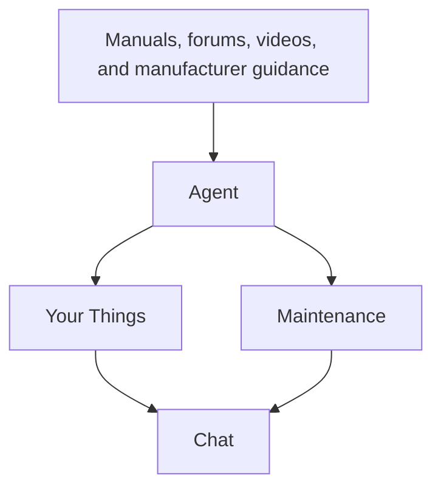
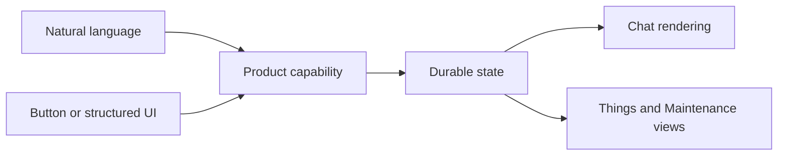
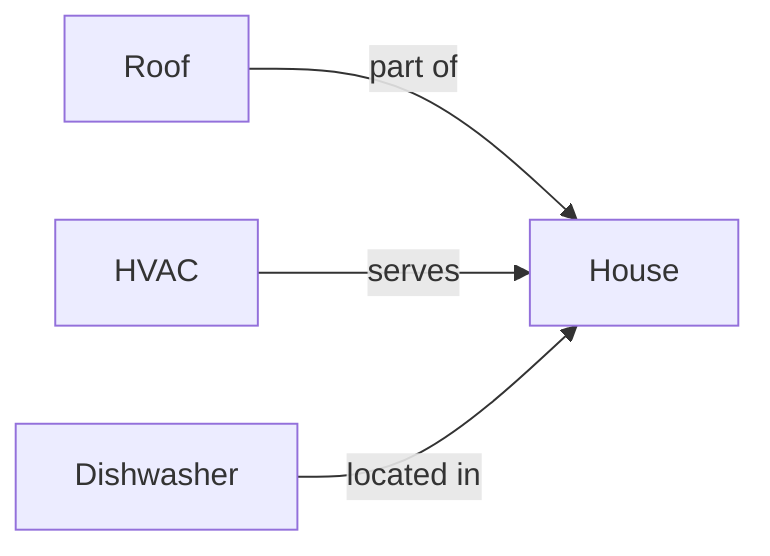
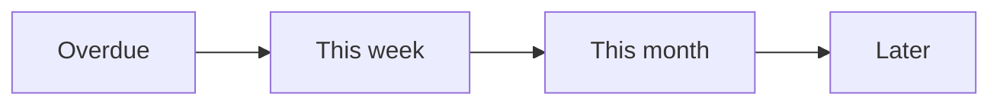
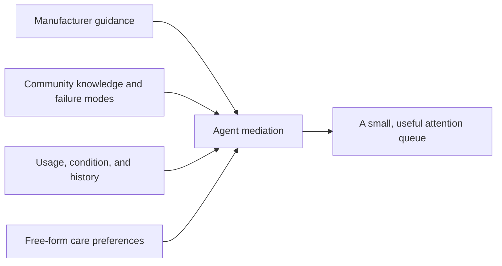
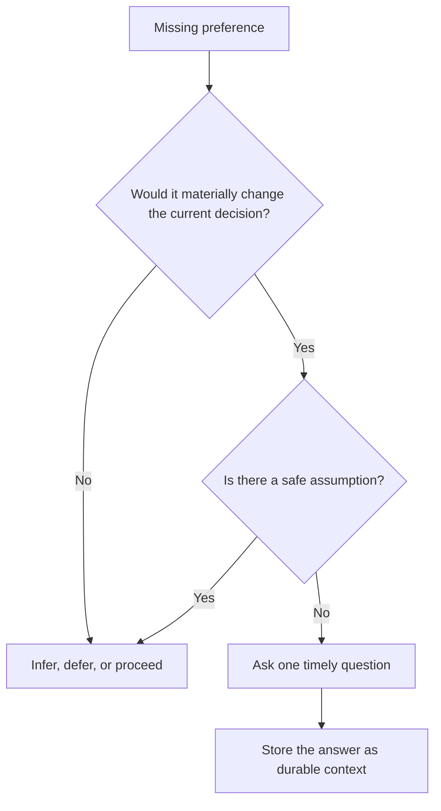
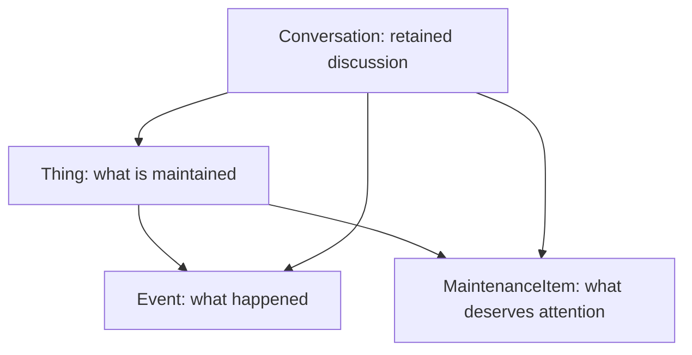
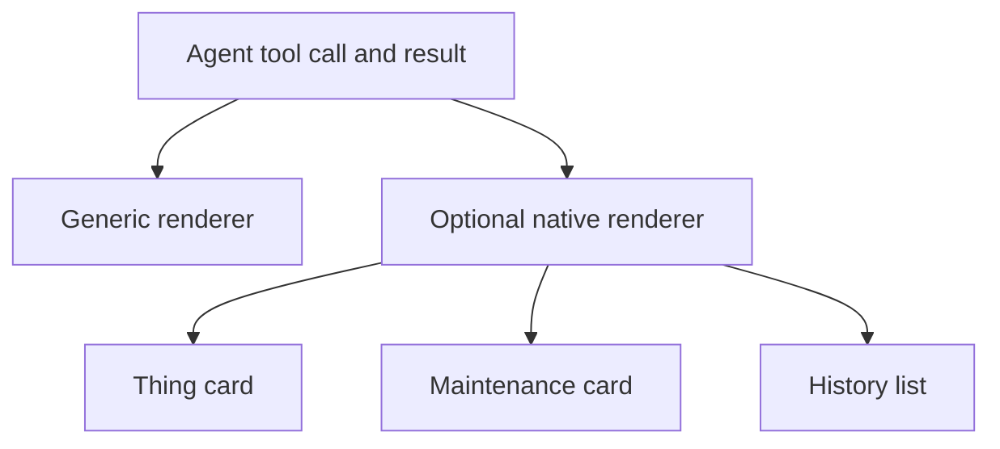
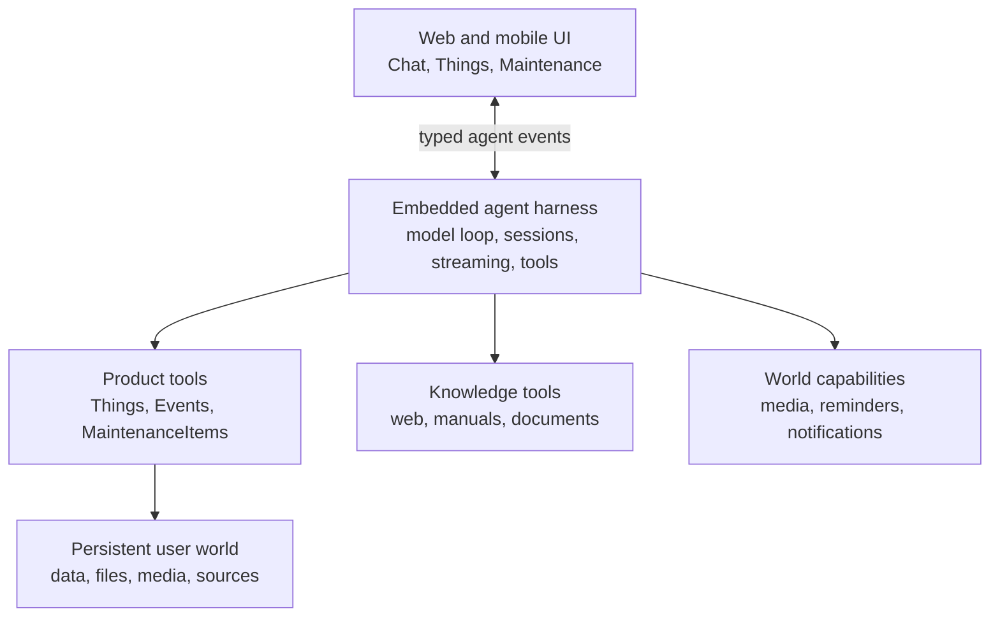

# Maintenance of Everything

Much of life is taking responsibility for what we hope will continue: homes, machines, gardens, practices, relationships, communities, and institutions. Keeping them going requires memory, attention, knowledge, and adaptation, but that work is fragmented and easy to defer.

**Maintenance of Everything is a personal agent for keeping what matters going.**

It begins with the physical things in your life. You talk to it like ChatGPT. Over time it learns what you own, remembers what happened, researches what matters, notices change, and helps turn attention into timely care.



The bet is simple: **responsibility becomes more capable when it has memory. Do not make the user operate a database about their possessions. Give an agent a durable understanding of their physical world and let it help keep that world going.**

## Mission and wedge

The mission is broader than possessions. Maintenance is the whole practice of keeping something going: preserving useful continuity, noticing deterioration, repairing damage, and adapting as circumstances change. Moe should help make responsibility less forgetful and more capable without creating work for its own sake.

The product wedge is physical Things. Houses, vehicles, appliances, tools, and machines give the prototype observable identity, history, condition, failure, guidance, and completed work. They let us test whether durable agent memory produces better care without first solving every kind of responsibility.

Other domains may eventually belong in the product, including gardens, practices, relationships, communities, and institutions. That possibility does not make them Things in the current model. A relationship is not an asset, another person's perspective is not canonical state, and sensitive forms of care will need their own product judgment, consent boundaries, and representations.

**Keep the mission broad and the first product concrete.** Moe is not a generic everything assistant; it is an agent for continuity, beginning with the physical world.

## The product

There are three primary surfaces:

| Surface | Purpose |
| --- | --- |
| **Chat** | Ask anything and get things done. The primary interface and control plane. |
| **Things** | See the durable, named things the agent understands and maintains with you. |
| **Maintenance** | See what deserves attention now, without managing a rigid calendar. |

Chat is primary. Things and Maintenance are structured projections of the same underlying world.

### Chat

The default experience should feel familiar to anyone who has used ChatGPT: conversations in the main pane, a simple input, and lightweight navigation to Things, Maintenance, and recent conversations.

Natural language should be enough:

> I changed the oil yesterday.

> What's this noise? [video]

> What did I use on the cabinets last time?

> I got the car serviced and they did everything that was due.

When appropriate, the agent translates conversation into durable state.

Structured UI accelerates common interactions. A maintenance card in chat might offer **Done** and **Later**, but tapping **Done** and saying “I did this yesterday” should invoke the same underlying capability.



Anything possible through structured UI should also be possible through natural conversation.

### Things

A **Thing** is a durable, named thing the user cares enough about to maintain independently: a house, roof, HVAC system, 4Runner, dishwasher, road bike, or espresso machine.

Things should be easy to browse as a flat list. Relationships can improve reasoning without forcing the physical world into a folder tree.



Not every concept the agent reasons about needs to become a Thing. A muffler is usually context about a car, not another sidebar item. If the user begins restoring it independently, it can be promoted to a Thing.

**Track what the user would plausibly recognize, revisit, or maintain independently.**

### Maintenance

Maintenance is an attention queue, not a calendar.



Broad windows are often more truthful than exact dates. The system can reason about dates, mileage, usage, seasons, condition, and recurrence without pretending every task is an appointment.

## Agent-mediated maintenance

There is no single correct maintenance schedule for a Thing. Source material describes a universe of possible work; the agent decides what is useful for this person and this Thing.



Care preferences should remain mostly free-form and can differ by Thing:

> Plans to keep the 4Runner long-term. Wants proactive work that materially improves reliability or condition. Normally uses a shop for scheduled service and does not want separate reminders for minor inspections included in that service.

Granularity is mediated too. A shop customer may need one “30,000-mile service” item; a do-it-yourself owner may want separate oil, tire, filter, and brake items.

**Model maintenance at the level the user acts on it, not necessarily the level the source describes it.**

### Learn by probing intelligently

The agent should learn preferences through use, not a large questionnaire.



Good questions appear at the moment they become useful: “Your first service is coming up. Do you normally take the car somewhere or do this yourself?”

### Identity is revisable

A Thing is the agent's current best grouping of facts about a physical object, not a permanently correct identity record. Its ID provides continuity; its name and attributes are revisable understanding. Events and maintenance are durable facts currently attributed to that Thing and may need to move when later evidence shows that two Things are the same or one Thing was actually two.

The agent should defer identity questions while it can make safe progress. It should ask when uncertainty could change the target, guidance, or durable attribution of the current action. Explicit corrections and statements that Things are the same or different are strong evidence, but ambiguous history should not be reassigned merely to make the data look tidy.

When understanding changes, the agent should repair the user's world without turning the user into a database operator:

- Merge duplicate Things without losing history, maintenance, or care preferences.
- Split a conflated Thing by moving only facts supported by evidence.
- Keep replaced or retired Things as history instead of renaming them into their replacements.
- Preserve unresolved distinctions until they become decision-relevant.

**Identity is a revisable interpretation; durable facts should survive revisions to that interpretation.**

## Strong nouns, weak schemas

The product needs enough semantics for reliable UI and behavior, without a rigid maintenance ontology.



- **Thing** — something worth independently maintaining and surfacing.
- **Event** — a durable historical fact: purchased, inspected, changed, repaired, or observed.
- **MaintenanceItem** — a future action or condition worthy of attention, at useful granularity.
- **Conversation** — a retained agent session that may concern one or many Things.

Relations, attachments, provenance, and sources can connect these nouns where useful. Categories and attributes should remain loose until repeated product needs justify stronger structure.

**Structure outcomes, not understanding.** Events and maintenance status need deterministic behavior. Nuanced care preferences can remain prose.

### Canonical facts, derived understanding

Durable state should be immutable wherever practical. Persist a fact or intention once, then derive the current picture from that canonical record instead of synchronizing copies across the system.

- A **Thing** holds current identity, stable configuration, location, and care preferences. It should not accumulate historical rollups such as last service or copied mileage readings.
- An **Event** is the canonical account of something that happened or was observed: completed work, measurements, usage, condition, findings, and provenance. Correct an Event explicitly when later evidence shows it is wrong; otherwise leave it unchanged.
- A **MaintenanceItem** is a future intention. Its source, rationale, and planned scope describe why the work deserves attention, not what ultimately happened.

Completing maintenance should atomically create an Event linked to the planned item. The completed item preserves the plan; the Event preserves actual completion details. A technician's weak-capacitor finding and a future capacitor-replacement item are not competing sources of truth: one is historical evidence and the other is intended action.

When a plan changes, archive intentions that are no longer useful instead of deleting them or marking them done. Archiving removes an item from attention but does not claim the work happened and does not create an Event.

Current mileage, last service, recent findings, elapsed time since work, and similar summaries should normally be derived from Events when a Thing is inspected. Materialize a derived value only after repeated product behavior proves that recomputing it is insufficient.

**Persist facts and intentions; derive current understanding.**

## Minimal, flexible agent tools

The agent should operate the product through a small set of composable primitives, not hard-coded maintenance workflows.

```text
Things:       search, get, create, update
History:      get history, record event
Maintenance:  list, create, update
Knowledge:    search and inspect sources
Media:        inspect images, video, and documents
```

The exact tool set should emerge through product use. Avoid tools such as `maintain_house` or `prepare_for_winter` when a capable agent can compose the result from simpler operations.

Tool calls are both actions and potential UI primitives:



The renderer is a client interpretation; the tool remains the product capability. This keeps Chat and structured surfaces in sync.

## High-level architecture

The agent should be a capable embedded harness, not a bespoke maintenance-specific loop.



The harness owns general agent mechanics. The application owns the user's world.

**Conversation memory is not the database.** If the user changes the oil, that fact should survive because the agent recorded an Event, not because it remains in model context.

The initial agent can stay general. Its specialization comes from good instructions, maintenance-oriented tools, persistent user context, and the product UI. More elaborate orchestration should appear only when experience proves it useful.

## Working principles

- **Chat is the control plane.** Structured surfaces expose common state; conversation remains the universal interface.
- **UI is acceleration.** Buttons and cards invoke the same capabilities available through language.
- **Flat navigation, relational intelligence.** Keep Things easy to browse without denying useful relationships.
- **Strong nouns, weak schemas.** Preserve product meaning while allowing the representation to evolve.
- **Structure outcomes, not understanding.** Keep deterministic product state structured and nuanced context flexible.
- **Prefer canonical state.** Persist facts and intentions once; derive current readings and summaries from history.
- **Maintenance is mediated.** Recommend what matters, when it matters, at the granularity the user uses.
- **Let preferences emerge.** Learn how a person cares for each Thing through interaction.
- **Probe intelligently.** Ask only when an answer materially improves the current decision.
- **Keep identity revisable.** Defer harmless uncertainty and preserve facts when Things are corrected, merged, or split.
- **Search before creating.** Improve the existing representation instead of duplicating the user's world.
- **The agent operates the application.** The user should not become a database clerk.
- **Prefer primitives over workflows.** Keep the agent free to reason and compose.
- **Let use shape the system.** Resist hardening schemas, orchestration, or product surfaces before real interactions demand it.

## Appendix: converging the system to the spec

The vision describes product behavior, not a promise that the current model, prompt, tools, and data representation already produce it. Changes should move the system toward the vision through a repeatable learning loop.

### The loop

1. **Observe or specify a behavior.** Start from real use or a concrete scenario whose desired outcome follows from the vision.
2. **Encode the behavior in evals.** Assert durable outcomes and forbidden mutations rather than exact wording or a preferred tool sequence.
3. **Record the baseline.** Keep useful failures. A red eval is evidence about the current system, not an instruction to patch around the case.
4. **Locate the failure.** Determine whether the model lacked context, made a poor judgment, lacked a capability, encountered unsafe tool semantics, or could not represent the outcome.
5. **Choose the lowest general lever.** Prefer a small mechanism that improves a class of scenarios over a rule that names the failing example.
6. **Implement the mechanism.** Keep semantic judgment with the agent and deterministic state integrity with the application.
7. **Rerun focused and full evals.** Inspect transcripts, tool calls, tool results, and final state; do not rely only on an aggregate score.
8. **Use the product.** Verify that passing the eval still feels natural in conversation and structured UI.
9. **Update the spec when learning changes it.** If an eval exposes a better product principle, change the vision and eval deliberately rather than weakening the assertion silently.

### Available levers

- **Evals** define the behavior independently of its implementation.
- **Context** makes current durable state and relevant evidence visible to the agent.
- **Instructions** express compact, general decision policy.
- **Tools** determine which changes the agent can make.
- **Tool semantics** provide validation, atomicity, and recoverability without deciding meaning for the agent.
- **Data model** represents outcomes that need deterministic behavior.
- **Conversation state** retains local discussion but does not replace durable application state.
- **UI** makes consequential actions understandable and gives common actions a direct path.
- **Model and reasoning settings** affect judgment quality after the model has the necessary context and capabilities.
- **Observability** distinguishes retrieval, judgment, execution, and representation failures.

The preferred direction is bitter-pilled: give a capable agent complete relevant context, a few expressive primitives, and responsibility for semantic decisions. Add application machinery only where deterministic integrity, atomicity, or repeated product behavior requires it. Do not encode a growing catalog of domain cases into prompts, workflows, or schemas.
